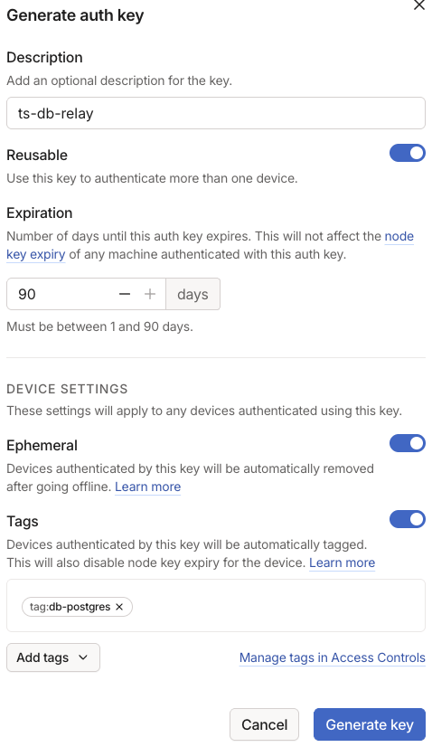

# ts-db-relay

A tsnet application letting Tailscale nodes access databases from anywhere using their Tailscale identity to authenticate.

This is a POC.

### Local setup

Note: setup from scratch in a new environment not tested yet. These steps likely made assumptions about pre-existing requirements.

1. Build the binary. Make sure to set `GOARCH=arm64` instead if you're intending to run this on a Silicon Mac.

   ```bash
    GOOS=linux GOARCH=amd64 go build -o ./cmd/ts-db-relay.exe ./...
   ```
1. (Optional) Start your custom Tailscale control server if not using https://login.tailscale.com/

   ```bash
    ./path/to/local/tailscale/server
   ```
   
1. Set the `TS_SERVER` environment variable to point to your Tailscale control server for future steps.

   ```bash
    export TS_SERVER=https://login.tailscale.com # http://localhost:31544 for local control
   ```
1. Connect your workstation to your Tailscale control server.

   ```bash
    tailscale up --login-server=$TS_SERVER
   ```

1. Configure the ts-db-relay capability in your tailnet policy file. ($TS_SERVER/admin/acls/file)

   ```json
    {
       "tagOwners": {"tag:db-postgres": ["autogroup:admin"]},
   
       "grants": [
           {
               "src": ["*"],
               "dst": ["tag:db-postgres"],
               "ip":  ["tcp:5432", "tcp:80"],
   
               "app": {
                   "tailscale.test/cap/ts-db-relay": [
                       {
                           "postgres": {
                               "impersonate": {
                                   "databases": ["testdb"],
                                   "users":     ["test"],
                               },
                           },
                       },
                   ],
               },
           },
       ],
    }
   ```
   
1. Create an authkey so the ts-db-relay node can join your tailnet. ($TS_SERVER/admin/settings/keys)

   

1. Set the `TS_AUTHKEY` environment variable with the authkey you created for future steps.

   ```bash
    export TS_AUTHKEY=tskey-auth-x-x # reusable ephemeral key is recommended for quick iterations
   ```

1. (Optional) If using a custom local control server, update the `TS_SERVER` environment variable for container access.

    ```bash
     export TS_SERVER=http://host.docker.internal:31544
    ```

1. Run docker compose to start a container with your local ts-db-relay binary and a Postgres database.

   ```bash
    docker compose -f test-setup/compose.yml up --build
   ```
   
1. Connect to the database over Tailscale, works from anywhere without credentials.

    ```bash
     psql "host=postgres-db port=5432 user=test dbname=testdb"
    ```